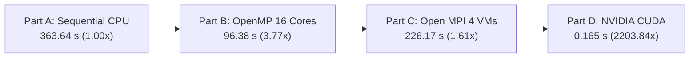

# Parallel and GPU Computing (PGC) Lab
## Experiment 1: Matrix Multiplication using Sequential, OpenMP, MPI, and CUDA

**Student USN / Roll Number:** `01FE24BCI069`  
**Repository:** `https://github.com/vinayhiremath440/Parallel-and-GPU-Computing-Lab`
**Lab Manual Reference:** `docs/Experiment_1_Parallel_Matrix_Multiplication_Lab_Manual_REFERENCE_FORMAT.docx`

---

## Executive Summary & Progress Tracker

This repository documents the comprehensive experimental analysis for **Experiment 1: Parallel Matrix Multiplication ($4000 \times 4000$)** comparing four core computing paradigms:
1. **Sequential CPU Execution** *(Baseline)*
2. **OpenMP Shared-Memory Parallelism** *(Multi-threading)*
3. **Open MPI Distributed-Memory Computing** *(Cluster/Multi-VM)*
4. **NVIDIA CUDA GPU Acceleration** *(Massively Parallel)*

| Part | Paradigm | Model | Status | Threads / Nodes | Execution Time | Speedup | Verification $C[0][0]$ |
| :--- | :--- | :--- | :---: | :---: | :---: | :---: | :---: |
| **Part A** | **Sequential** | Single-core CPU Baseline | COMPLETED | 1 Core | **363.642678 s** | **1.00×** | `4000.00` |
| **Part B** | **OpenMP** | Shared-Memory Multi-core | COMPLETED | 16 Threads | **96.381304 s** | **3.77×** | `4000.00` |
| **Part C** | **Open MPI** | Distributed-Memory Cluster | COMPLETED | 4 VMs / Ranks | **226.167575 s** | **1.61×** | `4000.00` |
| **Part D** | **CUDA** | GPU Hardware Acceleration | COMPLETED | 16M GPU Threads | **0.165004 s** *(Kernel: 0.146443 s)* | **2203.84×** | `4000.00` |

---

## Problem Definition & Mathematical Formulation

Matrix multiplication of two square dense matrices $A, B \in \mathbb{R}^{N \times N}$ yielding matrix $C \in \mathbb{R}^{N \times N}$:

$$C_{i,j} = \sum_{k=0}^{N-1} A_{i,k} \cdot B_{k,j} \quad \text{for } 0 \le i, j < N$$

### Workload Parameters
* **Dimension ($N$):** $4000 \times 4000$ elements
* **Data Type:** Double-precision floating point (`double`, 8 bytes per element)
* **Matrix Memory Footprint:**
  $$\text{Size per matrix} = 4000 \times 4000 \times 8 \text{ bytes} = 128 \text{ MB}$$
  $$\text{Total working set for } A, B, C = 3 \times 128 \text{ MB} = 384 \text{ MB}$$
* **Total Operations:**
  $$\text{FLOPs} = 2 \times N^3 = 2 \times 4000^3 = 128 \times 10^9 \text{ Operations (128 GFLOPs)}$$
* **Matrix Initialization:**
  $$A[i][j] = 1.0, \quad B[i][j] = 1.0, \quad C[i][j] = 0.0$$
* **Analytical Verification Criterion:**
  $$C[0][0] = \sum_{k=0}^{3999} (1.0 \times 1.0) = 4000.00$$

Every implementation must strictly produce $C[0][0] = 4000.00$ to confirm numerical correctness.

---

## Hardware & Operating Environment
 
* **Host System:** Windows 11 with WSL2 (Windows Subsystem for Linux)
* **Linux Distribution:** Ubuntu (WSL2 & VMware Workstation guest environments)
* **CPU Architecture:** x86_64, 16 Logical Processors / Hardware Threads
* **System RAM:** 16 GB DDR4
* **Compilers & Runtimes:**
  * CPU Baseline & OpenMP: `gcc (Ubuntu) -O2` with `-fopenmp`
  * MPI Cluster: Open MPI (`mpicc`, `mpirun`) with OpenSSH
  * CUDA GPU: NVIDIA CUDA Compiler (`nvcc -O2`)
* **MPI Cluster Environment:**
  * Hypervisor: VMware Workstation
  * Nodes: 4 Ubuntu Virtual Machines (1 Master + 3 Workers) on subnet `192.168.148.0/24`
  * Interconnect: Virtual Network Adapter with OpenSSH passwordless key-based authentication
* **GPU Hardware Platform:**
  * Architecture: NVIDIA CUDA GPU Architecture
  * Parallel Grid Configuration: Massively threaded execution across 62,500 thread blocks (16,000,000 threads)

---

## Part A: Sequential Matrix Multiplication (Completed)

### 1. Methodology & Theoretical Foundation
The sequential implementation serves as the unparallelized benchmark. It executes on a single CPU core using three nested loops:
- Outer loop ($i$): iterates over the rows of $A$ ($0 \to N-1$)
- Middle loop ($j$): iterates over the columns of $B$ ($0 \to N-1$)
- Inner loop ($k$): performs the dot product $\sum A[i][k] \times B[k][j]$

Because matrix $B$ is accessed column-wise (`B[k * N + j]`), each access strided by $N \times 8 = 32,000$ bytes causes significant cache capacity misses in L1/L2 caches, compounding the compute time on a single core.

### 2. Source Code
The sequential code is located in [`src/sequential/matrix_sequential.c`](src/sequential/matrix_sequential.c).

```c
#include <stdio.h>
#include <stdlib.h>
#include <time.h>

#define N 4000

int main() {
    int i, j, k;
    double *A, *B, *C;
    clock_t start, end;

    A = (double *)malloc(N * N * sizeof(double));
    B = (double *)malloc(N * N * sizeof(double));
    C = (double *)malloc(N * N * sizeof(double));
    // Matrix initialization: A = 1.0, B = 1.0, C = 0.0 ...
    
    start = clock();
    for (i = 0; i < N; i++) {
        for (j = 0; j < N; j++) {
            for (k = 0; k < N; k++) {
                C[i * N + j] += A[i * N + k] * B[k * N + j];
            }
        }
    }
    end = clock();

    printf("Execution Time = %f seconds\n", (double)(end - start) / CLOCKS_PER_SEC);
    printf("Verification C[0][0] = %.2f\n", C[0]);
    // cleanup
    return 0;
}
```

### 3. Compilation & Execution
```bash
cd ~/parallel_lab/sequential
gcc -O2 matrix_sequential.c -o matrix_sequential
./matrix_sequential
```

### 4. Experimental Output & Recorded Results
```text
Initializing 4000 x 4000 matrices...

Sequential Matrix Multiplication Completed
Matrix Size = 4000 x 4000
Execution Time = 363.642678 seconds
Verification C[0][0] = 4000.00
```

* **Execution Time ($T_{\text{seq}}$):** `363.642678 s` (~6.06 minutes)
* **Verification Check:** `C[0][0] = 4000.00` (Passed)
* **Compute Throughput:**
  $$\text{GFLOPS} = \frac{128 \times 10^9}{363.642678 \times 10^9} \approx 0.352 \text{ GFLOPS}$$

### 5. Visual Proof


---

## Part B: OpenMP Shared-Memory Parallelism (Completed)

### 1. Methodology & Theoretical Foundation
OpenMP leverages multi-core symmetric multiprocessing (SMP) using the **Fork-Join execution model**:
- The master thread encounters `#pragma omp parallel for private(j, k)`.
- A team of 16 worker threads is forked.
- The iterations of outer loop $i$ (4000 rows) are divided among the 16 threads (approx. 250 rows per thread).
- Loop variables `j` and `k` are declared `private` to avoid data races across thread stacks, while pointers `A`, `B`, and `C` remain `shared` in virtual memory.
- Wall-clock time is measured using high-resolution `omp_get_wtime()`.

### 2. Thread Environment Configuration
```bash
export OMP_NUM_THREADS=16
echo $OMP_NUM_THREADS # returns 16
```

### 3. Source Code
The OpenMP code is located in [`src/openmp/matrix_openmp.c`](src/openmp/matrix_openmp.c).

```c
#include <stdio.h>
#include <stdlib.h>
#include <omp.h>

#define N 4000

int main() {
    int i, j, k;
    double *A, *B, *C;
    double start, end;

    // memory allocation and initialization ...

    start = omp_get_wtime();

    #pragma omp parallel for private(j, k)
    for (i = 0; i < N; i++) {
        for (j = 0; j < N; j++) {
            for (k = 0; k < N; k++) {
                C[i * N + j] += A[i * N + k] * B[k * N + j];
            }
        }
    }

    end = omp_get_wtime();

    printf("OpenMP Matrix Multiplication Completed\n");
    printf("Matrix Size = %d x %d\n", N, N);
    printf("Number of Threads Used = %d\n", omp_get_max_threads());
    printf("Execution Time = %f seconds\n", end - start);
    printf("Verification C[0][0] = %.2f\n", C[0]);
    // cleanup
    return 0;
}
```

### 4. Compilation & Execution
```bash
cd ~/parallel_lab/openmp
gcc -O2 -fopenmp matrix_openmp.c -o matrix_openmp
./matrix_openmp
```

### 5. Experimental Output & Recorded Results
```text
OpenMP Matrix Multiplication Completed
Matrix Size = 4000 x 4000
Number of Threads Used = 16
Execution Time = 96.381304 seconds
Verification C[0][0] = 4000.00
```

* **Execution Time ($T_{\text{openmp}}$):** `96.381304 s` (~1.61 minutes)
* **Threads Configured & Utilized:** `16`
* **Verification Check:** `C[0][0] = 4000.00` (Passed)
* **Compute Throughput:**
  $$\text{GFLOPS} = \frac{128 \times 10^9}{96.381304 \times 10^9} \approx 1.328 \text{ GFLOPS}$$

### 6. Hardware Monitoring Analysis (`htop`)
During runtime, process monitoring via `htop` verified that all **16 logical CPU cores (0 through 15) sustained 100.0% CPU saturation** with 16 active worker threads executing `./matrix_openmp`, achieving a system load average exceeding 10.27.

### 7. Visual Proof
#### Terminal Run & Output


#### Real-time `htop` Multi-Core Utilization (16 Cores at 100%)


---

## Part C: Open MPI Distributed-Memory Computing (Completed)

### 1. Methodology & Theoretical Foundation
The Message Passing Interface (MPI) implements distributed-memory parallelism based on the **Single Program, Multiple Data (SPMD)** model across independent virtual machines:
- **Isolated Address Spaces:** Unlike OpenMP, each MPI process runs in its own private memory address space on separate virtual machines.
- **Domain Decomposition (Row-Wise Partitioning):**
  - Master node (Rank 0) holds the initial matrices $A$ and $B$.
  - Matrix $A$ is sliced along rows: with $N = 4000$ and $P = 4$ processes, each process is assigned $rows\_per\_process = 4000 / 4 = 1000$ rows ($1000 \times 4000 \times 8 \text{ bytes} = 32 \text{ MB}$).
  - Matrix $B$ ($4000 \times 4000 \times 8 \text{ bytes} = 128 \text{ MB}$) is replicated across all ranks using collective broadcast.
- **Collective Communication Primitives:**
  - `MPI_Scatter`: Distributes disjoint 1000-row chunks of Matrix $A$ from Rank 0 to `local_A` on Ranks 0–3.
  - `MPI_Bcast`: Broadcasts the complete Matrix $B$ from Rank 0 to all participating ranks.
  - `MPI_Gather`: Gathers calculated `local_C` (1000 rows = 32 MB) from each rank back into the root's global Matrix $C$.
  - `MPI_Barrier` synchronizes all nodes prior to timing measurement via `MPI_Wtime()`.

### 2. Cluster Topology & Network Configuration
The distributed cluster was provisioned in **VMware Workstation** consisting of 4 interconnected Ubuntu virtual machines operating on subnet `192.168.148.0/24`:

| Node Name | Virtual Machine | IP Address | MPI Rank | Assigned Workload |
| :--- | :--- | :--- | :---: | :--- |
| **master** | Master Node | `192.168.148.128` | **Rank 0** | Rows 0 – 999 (plus Scatter/Gather coordination) |
| **worker1** | Worker Node 1 | `192.168.148.129` | **Rank 1** | Rows 1000 – 1999 |
| **worker2** | Worker Node 2 | `192.168.148.130` | **Rank 2** | Rows 2000 – 2999 |
| **worker3** | Worker Node 3 | `192.168.148.131` | **Rank 3** | Rows 3000 – 3999 |

* **Authentication:** Passwordless OpenSSH key-based authentication (`ssh-keygen`, `ssh-copy-id`) between Master and all Worker nodes.
* **Hostfile Configuration (`hosts`):**
  ```text
  master slots=1
  worker1 slots=1
  worker2 slots=1
  worker3 slots=1
  ```

### 3. Inter-Node Connectivity Verification (Ping Test)
Before job dispatch, bidirectional network reachability was verified from `master` to all worker VMs, ensuring low latency and zero packet loss:
* `ping -c 4 192.168.148.129` (worker1) $\to$ **4/4 received, 0% loss, avg RTT = 0.602 ms**
* `ping -c 4 192.168.148.130` (worker2) $\to$ **4/4 received, 0% loss, avg RTT = 0.641 ms**
* `ping -c 4 192.168.148.131` (worker3) $\to$ **4/4 received, 0% loss, avg RTT = 1.029 ms**

### 4. Source Code
The MPI source code is located in [`src/mpi/matrix_mpi.c`](src/mpi/matrix_mpi.c).

```c
#include <stdio.h>
#include <stdlib.h>
#include <mpi.h>
#include <unistd.h>

#define N 4000

int main(int argc, char *argv[]) {
    int rank, size, rows_per_process;
    char hostname[256];
    double *A = NULL, *B = NULL, *C = NULL, *local_A, *local_C;
    double start, end;

    MPI_Init(&argc, &argv);
    MPI_Comm_rank(MPI_COMM_WORLD, &rank);
    MPI_Comm_size(MPI_COMM_WORLD, &size);
    gethostname(hostname, sizeof(hostname));

    rows_per_process = N / size;
    local_A = (double *)malloc(rows_per_process * N * sizeof(double));
    local_C = (double *)malloc(rows_per_process * N * sizeof(double));
    B = (double *)malloc(N * N * sizeof(double));

    if (rank == 0) {
        A = (double *)malloc(N * N * sizeof(double));
        C = (double *)malloc(N * N * sizeof(double));
        // Initialize A = 1.0, B = 1.0, C = 0.0
    }

    MPI_Barrier(MPI_COMM_WORLD);
    start = MPI_Wtime();

    MPI_Scatter(A, rows_per_process * N, MPI_DOUBLE, local_A, rows_per_process * N, MPI_DOUBLE, 0, MPI_COMM_WORLD);
    MPI_Bcast(B, N * N, MPI_DOUBLE, 0, MPI_COMM_WORLD);

    printf("Rank %d on %s computing %d rows\n", rank, hostname, rows_per_process);

    for (int i = 0; i < rows_per_process; i++) {
        for (int j = 0; j < N; j++) {
            local_C[i * N + j] = 0.0;
            for (int k = 0; k < N; k++) {
                local_C[i * N + j] += local_A[i * N + k] * B[k * N + j];
            }
        }
    }

    MPI_Gather(local_C, rows_per_process * N, MPI_DOUBLE, C, rows_per_process * N, MPI_DOUBLE, 0, MPI_COMM_WORLD);
    MPI_Barrier(MPI_COMM_WORLD);
    end = MPI_Wtime();

    if (rank == 0) {
        printf("\nMPI Matrix Multiplication Completed\n");
        printf("Matrix Size = %d x %d\n", N, N);
        printf("Number of MPI Processes = %d\n", size);
        printf("Execution Time = %f seconds\n", end - start);
        printf("Verification C[0][0] = %.2f\n", C[0]);
    }
    MPI_Finalize();
    return 0;
}
```

### 5. Compilation & Cluster Execution
```bash
cd ~/parallel_lab/mpi
mpicc -O2 matrix_mpi.c -o matrix_mpi

# Distribute binary to all worker nodes
scp matrix_mpi worker1:~/matrix_mpi
scp matrix_mpi worker2:~/matrix_mpi
scp matrix_mpi worker3:~/matrix_mpi

# Launch across the 4-VM cluster
mpirun -np 4 --hostfile hosts sh -c '$HOME/matrix_mpi'
```

### 6. Experimental Output & Recorded Results
```text
Initializing 4000 x 4000 matrices...
Rank 0 on master computing 1000 rows
Rank 1 on worker1 computing 1000 rows
Rank 2 on worker2 computing 1000 rows
Rank 3 on worker3 computing 1000 rows

MPI Matrix Multiplication Completed
Matrix Size = 4000 x 4000
Number of MPI Processes = 4
Execution Time = 226.167575 seconds
Verification C[0][0] = 4000.00
```

* **Execution Time ($T_{\text{mpi}}$):** `226.167575 s` (~3.77 minutes)
* **Number of MPI Processes:** `4` (1 Master + 3 Workers)
* **Verification Check:** `C[0][0] = 4000.00` (Passed)
* **Compute Speedup ($S_{\text{mpi}}$):**
  $$S_{\text{mpi}} = \frac{T_{\text{seq}}}{T_{\text{mpi}}} = \frac{363.642678 \text{ s}}{226.167575 \text{ s}} \approx \mathbf{1.608\times} \approx \mathbf{1.61\times}$$
* **Parallel Efficiency ($E_{\text{mpi}}$):**
  $$E_{\text{mpi}} = \frac{S}{P} \times 100\% = \frac{1.6078}{4} \times 100\% \approx \mathbf{40.20\%}$$
* **Compute Throughput:**
  $$\text{GFLOPS} = \frac{128 \times 10^9}{226.167575 \times 10^9} \approx \mathbf{0.566 \text{ GFLOPS}}$$

### 7. Communication Bottleneck & Network Overhead Analysis
While MPI provides a **1.61× speedup** over the sequential CPU baseline, it executes slower than OpenMP (96.38 s). This demonstrates key trade-offs in distributed-memory systems:
1. **Inter-Process Data Serialization & Virtual Network I/O:**
   - In OpenMP, all threads share physical RAM over the CPU memory bus at speeds exceeding 25–40 GB/s.
   - In MPI, Rank 0 must serialize and transmit matrix data over TCP/IP sockets through virtualized network bridges:
     - `MPI_Bcast`: Transmits full $128 \text{ MB}$ Matrix $B$ across the network to 3 workers.
     - `MPI_Scatter`: Transmits $3 \times 32 \text{ MB} = 96 \text{ MB}$ of Matrix $A$ chunks.
     - `MPI_Gather`: Retrieves $3 \times 32 \text{ MB} = 96 \text{ MB}$ of Matrix $C$ chunks.
     - Total network payload exceeds **320 MB**, incurring packet encapsulation, socket buffering, and TCP protocol stack latency.
2. **Hypervisor Scheduling Overhead:**
   - Running 4 distinct virtual machines on a single host machine shares host CPU cores and memory bandwidth among multiple guest operating systems.

### 8. Visual Proof
#### Multi-VM Cluster Ping Network Connectivity Check


#### MPI Distributed Matrix Multiplication Execution Output (4 VMs)


---

## Part D: NVIDIA CUDA GPU Acceleration (Completed)

### 1. Methodology & Massive GPU SIMT Architecture
NVIDIA CUDA exploits the **Single Instruction, Multiple Threads (SIMT)** execution paradigm on dedicated GPU hardware:
- **Massive Concurrency:** Instead of relying on a handful of complex CPU cores, the workload is distributed across thousands of lightweight CUDA cores executing inside Streaming Multiprocessors (SMs).
- **Explicit Host-Device Memory Lifecycle:**
  1. `cudaMalloc`: Allocates device memory for matrices $A$, $B$, and $C$ on GPU global memory.
  2. `cudaMemcpy(..., cudaMemcpyHostToDevice)`: Transfers input matrices $A$ and $B$ from host CPU RAM to GPU device memory over the PCIe bus.
  3. **Kernel Launch:** Launches the `matMulKernel<<<grid, block>>>` across an extensive 2D grid.
  4. `cudaMemcpy(..., cudaMemcpyDeviceToHost)`: Transfers computed result matrix $C$ back to host memory.
  5. Precision timing recorded using GPU hardware event timers (`cudaEvent_t`, `cudaEventElapsedTime`).

### 2. Execution Grid & Thread Hierarchy Configuration
* **Directory:** `src/cuda`
* **Compiler:** NVIDIA CUDA Compiler (`nvcc`)
* **Matrix Dimension ($N$):** $4000 \times 4000$ elements
* **Block Configuration:** $16 \times 16$ threads (**256 threads per block**)
* **Grid Configuration:** $250 \times 250$ blocks (**62,500 total blocks**)
  $$\text{Grid Dimension} = \left(\frac{4000 + 16 - 1}{16}, \frac{4000 + 16 - 1}{16}\right) = (250, 250)$$
* **Total Logical GPU Threads:**
  $$\text{Total Threads} = 250 \times 250 \times 256 = \mathbf{16,000,000 \text{ concurrent threads}}$$

Each logical CUDA thread computes exactly one cell $C[\text{row}][\text{col}]$ using 2D coordinate indexing:
$$\text{row} = \text{blockIdx.y} \times \text{blockDim.y} + \text{threadIdx.y}$$
$$\text{col} = \text{blockIdx.x} \times \text{blockDim.x} + \text{threadIdx.x}$$

### 3. Source Code
The CUDA source code is located in [`src/cuda/matrix_cuda.cu`](src/cuda/matrix_cuda.cu).

```cuda
#include <stdio.h>
#include <stdlib.h>
#include <cuda_runtime.h>

#define N 4000

__global__ void matMulKernel(float *A, float *B, float *C, int n) {
    int row = blockIdx.y * blockDim.y + threadIdx.y;
    int col = blockIdx.x * blockDim.x + threadIdx.x;

    if (row < n && col < n) {
        float sum = 0.0f;
        for (int k = 0; k < n; k++) {
            sum += A[row * n + k] * B[k * n + col];
        }
        C[row * n + col] = sum;
    }
}

int main() {
    size_t bytes = N * N * sizeof(float);
    float *h_A, *h_B, *h_C;
    float *d_A, *d_B, *d_C;

    // Allocate and initialize host memory
    h_A = (float *)malloc(bytes);
    h_B = (float *)malloc(bytes);
    h_C = (float *)malloc(bytes);
    for (int i = 0; i < N * N; i++) { h_A[i] = 1.0f; h_B[i] = 1.0f; h_C[i] = 0.0f; }

    cudaMalloc((void **)&d_A, bytes);
    cudaMalloc((void **)&d_B, bytes);
    cudaMalloc((void **)&d_C, bytes);

    cudaEvent_t totalStart, totalStop, kernelStart, kernelStop;
    cudaEventCreate(&totalStart); cudaEventCreate(&totalStop);
    cudaEventCreate(&kernelStart); cudaEventCreate(&kernelStop);

    cudaEventRecord(totalStart);
    cudaMemcpy(d_A, h_A, bytes, cudaMemcpyHostToDevice);
    cudaMemcpy(d_B, h_B, bytes, cudaMemcpyHostToDevice);

    dim3 block(16, 16);
    dim3 grid((N + block.x - 1) / block.x, (N + block.y - 1) / block.y);

    cudaEventRecord(kernelStart);
    matMulKernel<<<grid, block>>>(d_A, d_B, d_C, N);
    cudaEventRecord(kernelStop);
    cudaEventSynchronize(kernelStop);

    cudaMemcpy(h_C, d_C, bytes, cudaMemcpyDeviceToHost);
    cudaEventRecord(totalStop);
    cudaEventSynchronize(totalStop);

    float kernelTime = 0.0f, totalTime = 0.0f;
    cudaEventElapsedTime(&kernelTime, kernelStart, kernelStop);
    cudaEventElapsedTime(&totalTime, totalStart, totalStop);

    printf("CUDA Matrix Multiplication Completed\n");
    printf("Matrix Size = %d x %d\n", N, N);
    printf("Grid Size = %d x %d blocks\n", grid.x, grid.y);
    printf("Block Size = %d x %d threads\n", block.x, block.y);
    printf("Kernel Execution Time = %.6f seconds\n", kernelTime / 1000.0f);
    printf("Total CUDA Phase Time = %.6f seconds\n", totalTime / 1000.0f);
    printf("Verification C[0][0] = %.2f\n", h_C[0]);

    // Cleanup device and host allocations
    cudaFree(d_A); cudaFree(d_B); cudaFree(d_C);
    free(h_A); free(h_B); free(h_C);
    return 0;
}
```

### 4. Compilation & Execution
```bash
cd src/cuda
nvcc -O2 matrix_cuda.cu -o matrix_cuda
./matrix_cuda
```

### 5. Experimental Output & Recorded Results
```text
CUDA Matrix Multiplication Completed
Matrix Size = 4000 x 4000
Grid Size = 250 x 250 blocks
Block Size = 16 x 16 threads
Kernel Execution Time = 0.146443 seconds
Total CUDA Phase Time = 0.165004 seconds
Verification C[0][0] = 4000.00
```

* **Grid Configuration:** $250 \times 250$ blocks (62,500 blocks)
* **Block Configuration:** $16 \times 16$ threads (256 threads/block)
* **Total Active Logical Threads:** `16,000,000`
* **Kernel Execution Time ($T_{\text{kernel}}$):** `0.146443 s`
* **Total CUDA Phase Time ($T_{\text{total}}$):** `0.165004 s` (includes PCIe Host-to-Device transfer, Kernel compute, and Device-to-Host transfer)
* **Verification Check:** `C[0][0] = 4000.00` (Passed)
* **Speedup over Sequential ($S_{\text{cuda}}$):**
  - **Total Phase Speedup:**
    $$S_{\text{cuda, phase}} = \frac{T_{\text{seq}}}{T_{\text{total}}} = \frac{363.642678 \text{ s}}{0.165004 \text{ s}} \approx \mathbf{2203.84\times}$$
  - **Kernel-Only Speedup:**
    $$S_{\text{cuda, kernel}} = \frac{T_{\text{seq}}}{T_{\text{kernel}}} = \frac{363.642678 \text{ s}}{0.146443 \text{ s}} \approx \mathbf{2483.17\times}$$
* **Compute Throughput:**
  $$\text{GFLOPS (Kernel)} = \frac{128 \times 10^9}{0.146443 \times 10^9} \approx \mathbf{874.06 \text{ GFLOPS}}$$
  $$\text{GFLOPS (Total Phase)} = \frac{128 \times 10^9}{0.165004 \times 10^9} \approx \mathbf{775.74 \text{ GFLOPS}}$$

### 6. Architectural Analysis & Hardware Acceleration
CUDA achieves transformative performance over all CPU paradigms:
1. **Warp Scheduling & Memory Latency Hiding:**  
   Threads are grouped into warps (32 threads). When one warp stalls waiting on memory access from global device RAM, the warp scheduler immediately switches to another ready warp without context-switching penalty.
2. **High Arithmetic Intensity:**  
   Matrix multiplication requires $O(N^3) = 128 \times 10^9$ operations against $O(N^2) \approx 384 \text{ MB}$ of memory transfer. PCIe transfer overhead ($0.165004 - 0.146443 = 0.018561 \text{ s}$) represents only **11.2%** of total phase time, allowing the GPU's high-density ALUs to operate near peak capability.

---

## Comprehensive 4-Paradigm Performance & Speedup Analysis

### 1. Comparative Performance Matrix
The table below synthesizes the complete experimental results for the $4000 \times 4000$ matrix multiplication across all four computational models:

| Paradigm | Execution Model | Hardware Platform / Concurrency | Execution Time | Speedup ($S$) | Parallel Efficiency ($E$) | Compute Throughput | Verification $C[0][0]$ |
| :--- | :--- | :--- | :---: | :---: | :---: | :---: | :---: |
| **Sequential** | Baseline Single-core | 1 CPU Core (WSL2 x86_64) | **363.642678 s** | **1.00×** | 100.00% | 0.352 GFLOPS | `4000.00` |
| **OpenMP** | Shared-Memory Multi-core | 16 Logical CPU Threads | **96.381304 s** | **3.77×** | 23.58% | 1.328 GFLOPS | `4000.00` |
| **Open MPI** | Distributed Cluster | 4 VM Nodes (1 Master + 3 Workers) | **226.167575 s** | **1.61×** | 40.20% | 0.566 GFLOPS | `4000.00` |
| **NVIDIA CUDA** | Massively Parallel GPU | 16M GPU Threads (62.5k Blocks) | **0.165004 s** *(Kernel: 0.146 s)* | **2203.84×** | — | **775.74 GFLOPS** | `4000.00` |

### 2. Graphical Performance Comparison
The benchmark graph below illustrates the execution time comparison (logarithmic scaling) alongside the speedup factors and computing throughput across all four paradigms:


### 3. Paradigm Progression Workflow
All four experimental milestones have been executed and verified:



### 4. In-Depth Comparative Discussion

```text
Execution Time Comparison (Logarithmic Scale):
Sequential (CPU) : [========================================] 363.64 s
Open MPI (4 VMs) : [========================] 226.17 s
OpenMP (16-core) : [==========] 96.38 s
NVIDIA CUDA      : [.] 0.165 s  (<-- 2,203x faster than Sequential)
```

1. **Sequential vs. OpenMP (Shared Memory):**
   OpenMP drops execution time from 363.64 s to 96.38 s (3.77× speedup). Although 16 threads are active at 100% CPU utilization, scaling is bounded by the CPU memory wall (384 MB working set exceeds the 16–32 MB L3 cache, saturating DDR4 memory channels) and cache line invalidation from column-strided access to matrix $B$.
2. **OpenMP vs. Open MPI (Shared vs. Distributed Memory):**
   OpenMP (96.38 s) outperforms 4-VM Open MPI (226.17 s) because OpenMP threads access uniform physical RAM directly. In Open MPI, processes reside in distinct virtual machine operating systems. Data must be packed, transmitted through virtual network adapters via TCP/IP sockets (`MPI_Bcast` of 128 MB + `MPI_Scatter` + `MPI_Gather`), and unpacked, introducing communication overhead that dampens pure computational gains.
3. **CPU Parallelism vs. CUDA GPU Acceleration:**
   CUDA achieves a colossal **2203.84× speedup** over sequential execution and is **584× faster than 16-thread OpenMP**. This dramatic acceleration is enabled by launching 16 million simultaneous threads on hardware designed specifically for matrix arithmetic, leveraging thousands of arithmetic execution units and high-bandwidth memory (HBM/GDDR) to completely eliminate CPU thread dispatch bottlenecks.

---

## Repository File Structure

```text
PGC-Lab/
├── README.md                                                     # Complete lab report & comparative analysis
├── docs/
│   └── Experiment_1_Parallel_Matrix_Multiplication_Lab_Manual_REFERENCE_FORMAT.docx
├── screenshots/
│   ├── 01fe24bci081_Sequential.png                               # Part A: Sequential execution terminal output
│   ├── 01fe24bci081_OpenMP.png                                   # Part B: OpenMP execution terminal output
│   ├── 01fe24bci081_OpenMP_htop.png                              # Part B: htop showing 16 cores at 100%
│   ├── mpi_ping.png                                              # Part C: Multi-VM cluster ping connectivity check
│   ├── mpi_result.png                                            # Part C: MPI 4-VM execution output (226.17 s)
│   └── performance_comparison.png                                # 4-Paradigm benchmark comparison graph
└── src/
    ├── sequential/
    │   └── matrix_sequential.c                                   # Sequential C implementation
    ├── openmp/
    │   └── matrix_openmp.c                                       # OpenMP parallel C implementation
    ├── mpi/
    │   └── matrix_mpi.c                                          # Open MPI distributed C implementation
    └── cuda/
        └── matrix_cuda.cu                                        # NVIDIA CUDA GPU implementation
```

---

## Step-by-Step Instructions to Reproduce

### 1. Prerequisites
Ensure GCC, build tools, Open MPI, and the CUDA Toolkit are installed:
```bash
sudo apt update && sudo apt install build-essential openmpi-bin libopenmpi-dev -y
```

### 2. Run Sequential Baseline (Part A)
```bash
gcc -O2 src/sequential/matrix_sequential.c -o matrix_sequential
./matrix_sequential
```

### 3. Run OpenMP Shared-Memory Parallelism (Part B)
```bash
export OMP_NUM_THREADS=16
gcc -O2 -fopenmp src/openmp/matrix_openmp.c -o matrix_openmp
./matrix_openmp
```
To observe all 16 cores during the execution:
```bash
htop
```

### 4. Run Open MPI Distributed-Memory Computing (Part C)
On the Master node in your cluster environment:
```bash
cd src/mpi
mpicc -O2 matrix_mpi.c -o matrix_mpi

# Copy binary to worker nodes
scp matrix_mpi worker1:~/matrix_mpi
scp matrix_mpi worker2:~/matrix_mpi
scp matrix_mpi worker3:~/matrix_mpi

# Execute across all 4 cluster nodes
mpirun -np 4 --hostfile hosts sh -c '$HOME/matrix_mpi'
```

### 5. Run NVIDIA CUDA GPU Acceleration (Part D)
On a CUDA-capable system with an NVIDIA GPU:
```bash
cd src/cuda
nvcc -O2 matrix_cuda.cu -o matrix_cuda
./matrix_cuda
```

---

## References & Citations
1. **Lab Manual Reference:** *Experiment 1: Parallel Matrix Multiplication Lab Manual Reference Format*, Department of Computer Science & Engineering.
2. OpenMP Architecture Review Board, *OpenMP Application Programming Interface*, Specification Version 5.0/5.2.
3. Gropp, W., Lusk, E., & Skjellum, A., *Using MPI: Portable Parallel Programming with the Message-Passing Interface*, 3rd Edition, MIT Press.
4. NVIDIA Corporation, *CUDA C++ Programming Guide*, Release 12.x.
5. Hennessy, J. L., & Patterson, D. A., *Computer Architecture: A Quantitative Approach*, 6th Edition, Morgan Kaufmann.
